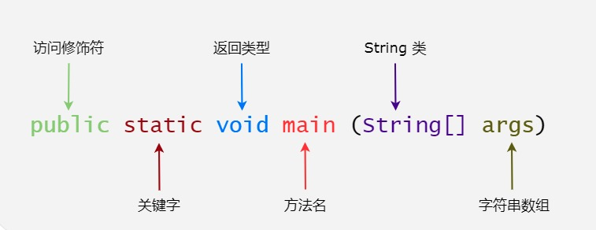

# java简介

> Java 是由 Sun Microsystems 公司于 1995 年 5 月推出的 Java 面向对象程序设计语言和 Java 平台的总称。由 James Gosling和同事们共同研发，并在 1995 年正式推出。后来 Sun 公司被 Oracle （甲骨文）公司收购，Java 也随之成为 Oracle 公司的产品。

Java分为三个体系：
- JavaSE（J2SE）（Java2 Platform Standard Edition，java平台标准版）
- JavaEE(J2EE)  (Java 2 Platform,Enterprise Edition，java平台企业版)
- JavaME(J2ME)  (Java 2 Platform Micro Edition，java平台微型版)。

> 2005 年 6 月，JavaOne 大会召开，SUN 公司公开 Java SE 6。此时，Java 的各种版本已经更名，以取消其中的数字 "2"：J2EE 更名为 Java EE，J2SE 更名为Java SE，J2ME 更名为 Java ME。

# Java 基础语法
>一个 Java 程序可以认为是一系列对象的集合，而这些对象通过调用彼此的方法来协同工作。下面简要介绍下类、对象、方法和实例变量的概念。

- 对象：对象是类的一个实例，有状态和行为。例如，一条狗是一个对象，它的状态有：颜色、名字、品种；行为有：摇尾巴、叫、吃等。
- 类：类是一个模板，它描述一类对象的行为和状态。
- 方法：方法就是行为，一个类可以有很多方法。逻辑运算、数据修改以及所有动作都是在方法中完成的。
- 实例变量：每个对象都有独特的实例变量，对象的状态由这些实例变量的值决定。

```java
public class HelloWorld {
    /* 第一个Java程序
     * 它将输出字符串 Hello World
     */
    public static void main(String[] args) {
        System.out.println("Hello World"); // 输出 Hello World
    }
}
```



下面将逐步介绍如何保存、编译以及运行这个程序：

1. 打开代码编辑器，把上面的代码添加进去；
2. 把文件名保存为：HelloWorld.java；
3. 打开 cmd 命令窗口，进入目标文件所在的位置，假设是 C:\
4. 在命令行窗口输入 javac HelloWorld.java 按下回车键编译代码。如果代码没有错误，cmd 命令提示符会进入下一行（假设环境变量都设置好了）。
再键输入 java HelloWorld 按下回车键就可以运行程序了

你将会在窗口看到 Hello World

```java
$ javac HelloWorld.java
$ java HelloWorld 
Hello World
```

编写 Java 程序时，应注意以下几点：

1. <strong>大小写敏感</strong>：Java 是大小写敏感的，这就意味着标识符 Hello 与 hello 是不同的。
2. <strong>类名</strong>：对于所有的类来说，类名的首字母应该大写。如果类名由若干单词组成，那么每个单词的首字母应该大写，例如 MyFirstJavaClass 。
3. <strong>方法名</strong>：所有的方法名都应该以小写字母开头。如果方法名含有若干单词，则后面的每个单词首字母大写。
4. <strong>源文件名</strong>：源文件名必须和类名相同。当保存文件的时候，你应该使用类名作为文件名保存（切记 Java 是大小写敏感的），文件名的后缀为 <strong>.java</strong>。（如果文件名和类名不相同则会导致编译错误）。
5. <strong>主方法入口</strong>：所有的 Java 程序由 public static void main(String[] args) 方法开始执行。

# Java 标识符
> Java 所有的组成部分都需要名字。类名、变量名以及方法名都被称为标识符。关于 Java 标识符，有以下几点需要注意：

- 所有的标识符都应该以字母（A-Z 或者 a-z）,美元符（$）、或者下划线（_）开始
- 首字符之后可以是字母（A-Z 或者 a-z）,美元符（$）、下划线（_）或数字的任何字符组合
- 关键字不能用作标识符
- 标识符是大小写敏感的
- 合法标识符举例：age、$salary、_value、__1_value
- 非法标识符举例：123abc、-salary

# Java修饰符
像其他语言一样，Java可以使用修饰符来修饰类中方法和属性。主要有两类修饰符：

- 访问控制修饰符 : default, public , protected, private
- 非访问控制修饰符 : final, abstract, static, synchronized